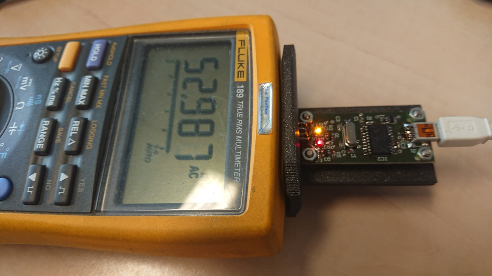
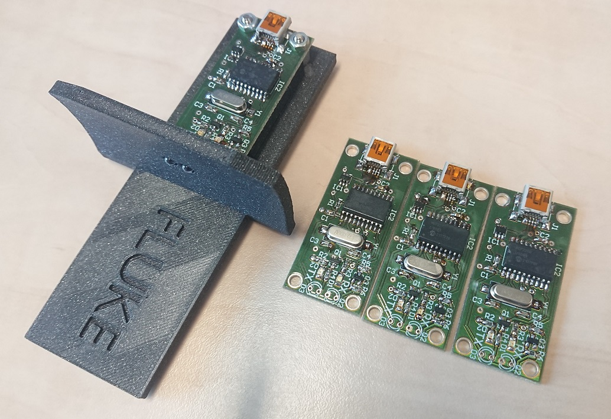

# FLUKE ScopeMeter USB-UART IR Interface (HW & SW Project)
 This is an open-source hardware and software project intended to replace the official overpriced FLUKE PM9080 InfraRed RS-232 Interface. 
 
 The final USB-UART IR interface mounted on a custom 3D printed holder is connected to the FLUKE 189 True RMS Multimeter and shown in the image below. The working principle is simple, the UART TX line drives an isolating IR diode and the UART RX line is driven by an isolating IR phototransistor.

## Repository Contents

* **Hardware folder** - Contains complete Altium Designer 6 PCB project, including PDF schematic and layout visualisations.
* **Software fodler** - Contains example Python codes (using pyserial package for serial communication).
* **3D Print folder** - Contains Blender file for the printable holder, including model STEP file. There is an older version (on the photo above) and a newer version with a protection box hiding the PCB board completely.
* **Gerber ZIP file** - An archive containing generated production files for the PCB.
* **Conf file** - Configuration file for the MCP2200 Configuration Utility (which can be downloaded [from the official Microchip site](https://www.microchip.com/en-us/product/MCP2200)).

## Bill Of Material (BOM)

| **IDs** | **Pcs** | **Value/Type** | **Description**                | **Package** |
|---------|---------|----------------|--------------------------------|-------------|
| C1      | 1       | 100n           | Ceramic capacitor              | 0603        |
| C2,C3   | 2       | 22p            | Ceramic capacitor              | 0603        |
| C4      | 1       | 330n           | Ceramic capacitor              | 0603        |
| D1,D2   | 2       | Red/green      | LED diode                      | 0603        |
| D3      | 1       | 15400385A3590  | IR diode 850nm 50mA            | T-1 (3mm)   |
| IC1     | 1       | USBLC6-2       | ESD protection for USB         | SOT23-6     |
| IC2     | 1       | MCP2200-I/SO   | USB-UART interface bridge      | SOIC-20     |
| J1      | 1       | 65100516121    | Mini USB Type B                | 5-pin       |
| R1,R5   | 2       | 1k             | Resistor                       | 0603        |
| R2,R3   | 2       | 470R           | Resistor                       | 0603        |
| R4      | 1       | 100R           | Resistor                       | 0603        |
| R6      | 1       | 10k            | Resistor                       | 0603        |
| Q1      | 1       | BSS138         | N-Channel logic-level MOSFET   | SOT23-3     |
| Q2      | 1       | BPW85          | IR phototransistor 850nm       | T-1 (3mm)   |
| Q3      | 1       | BC847B         | NPN general-purpose transistor | SOT23-3     |
| Y1      | 1       | 12MHz          | SMD crystal                    | HC-49/US    |

## Photo of the Assembled Boards

